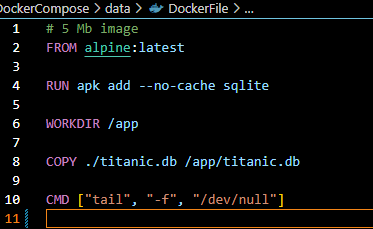
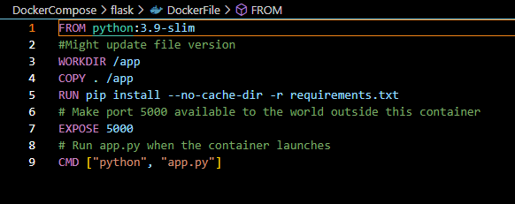
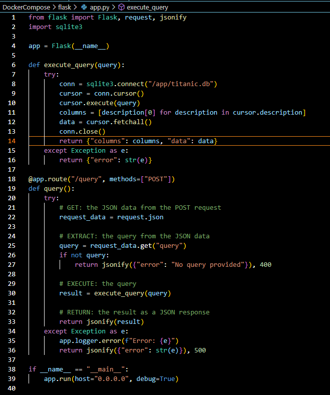
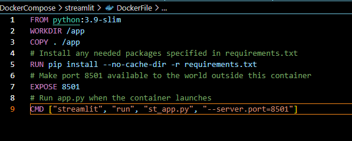
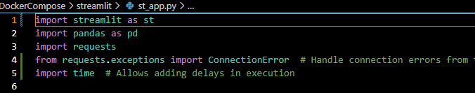
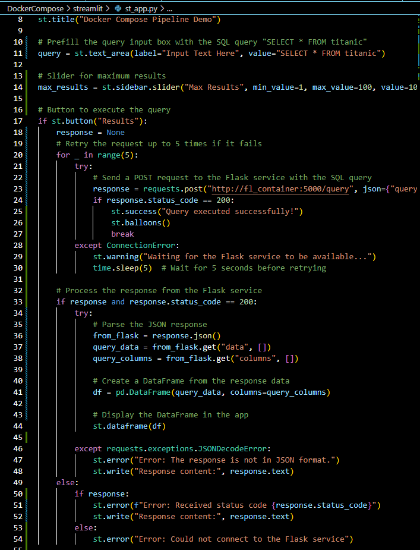
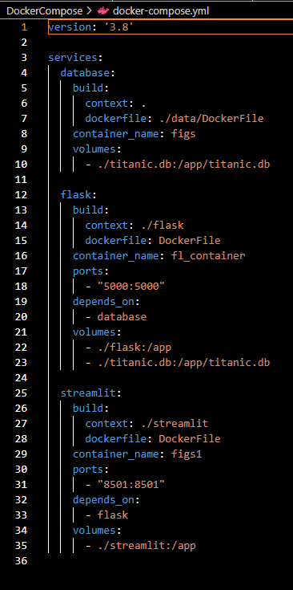

 # Docker Compose Pipeline Demo

This project demonstrates a Docker Compose pipeline that integrates a Flask backend with a Streamlit frontend to query and display data from a SQLite database. The application uses Docker to containerize the services and streamline the development and deployment process.

## Step 1: Project Structure
- Docker installed on your machine

#### File Directory Setup:

`project-root/
│
├── data/
│ ├── DockerFile
│ └── titanic.db
│
├── flask/
│ ├── app.py
│ ├── requirements.txt
│ └── DockerFile
│
├── streamlit/
│ ├── st_app.py
│ ├── requirements.txt
│ └── DockerFile
│
└── docker-compose.yml`

## Step 2: Setup the SQLite Database Service

#### Docker File: 

## Step 3: Setup the Flask Backend Service
#### requirments.txt: 
- streamlit
- pandas
- requests

#### Docker File:

#### .py File:

## Step 4: Setup the Streamlit Frontend Service
#### requirments.txt:

- streamlit
- pandas
- requests

#### Docker File: 

#### py File: 

## Step 5: Create the Docker Compose File

## Running the Application

### Build and start the containers:

`docker-compose up --build
`
- This command will build and start the Docker containers for the database, Flask backend, and Streamlit frontend.

#### Access the Streamlit app:

- Open your web browser and go to http://localhost:8501 to access the Streamlit application.

## How It Works

### SQLite Database:

- The SQLite database container (figs) holds the Titanic dataset in titanic.db.
- The Dockerfile in data/ sets up this container using the Alpine image and copies the database file.

### Flask Backend:

- The Flask application container (fl_container) handles SQL queries from the frontend.
- It connects to the SQLite database, executes the queries, and returns the results as JSON.
- The Dockerfile in flask/ sets up this container with the necessary dependencies.

### Streamlit Frontend:

- The Streamlit application container (figs1) provides a user interface to input SQL queries and display results.
- Users can input SQL queries, and the frontend sends these to the Flask backend for processing.

- The Dockerfile in streamlit/ sets up this container with the necessary dependencies.