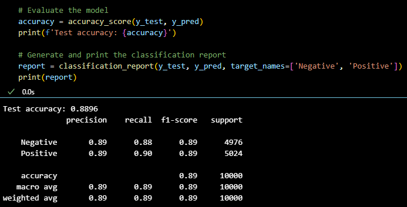
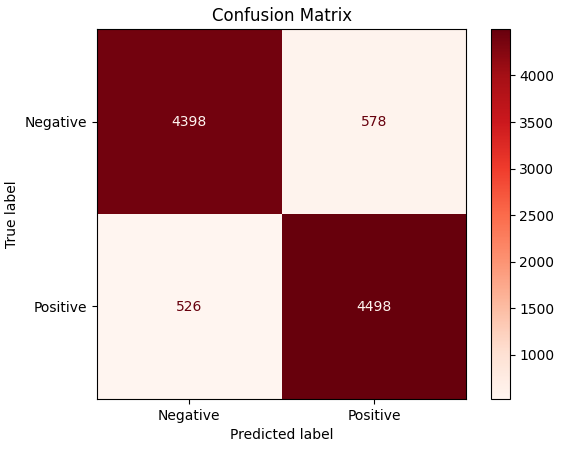
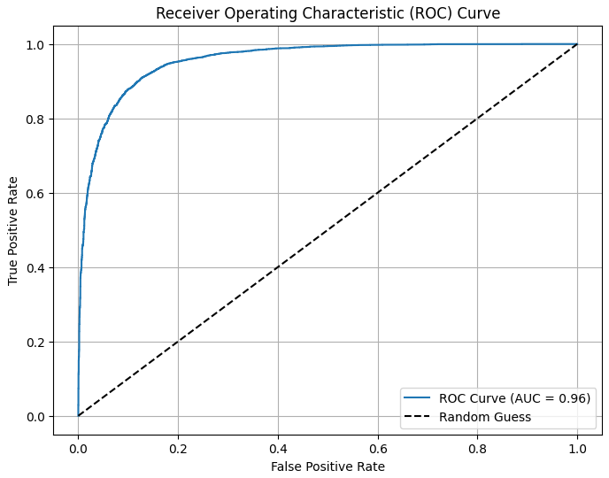
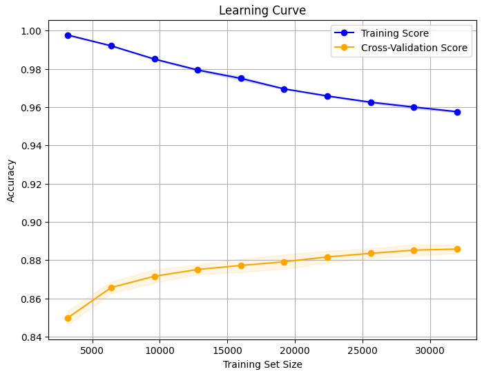
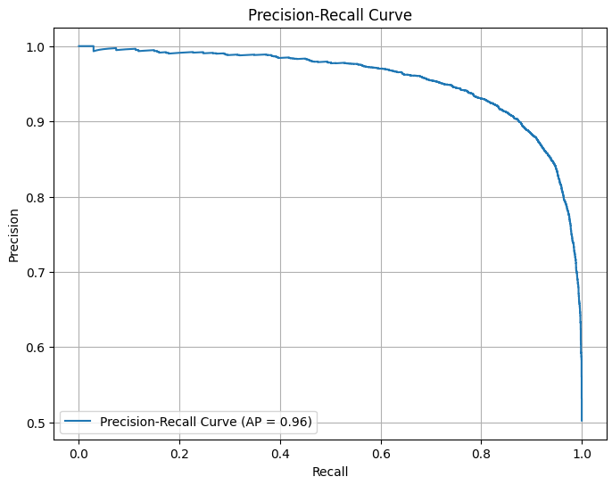

# IMDB Movie Reviews Sentiment Analysis

## Overview

This project explores sentiment analysis on IMDB movie reviews using various NLP techniques and machine learning models. The objective is to classify reviews as positive or negative, leveraging NLTK for text preprocessing and a Linear Support Vector Classifier (LinearSVC) for classification. The project includes a Jupyter Notebook for model training and evaluation, as well as a Streamlit application for an interactive user experience.

After building and evaluating the LinearSVC model, we compared a sample of the reviews by running them through an LLM Studios chatbot created in another project. This comparison allowed us to perform sentiment analysis using both models and assess their performance against each other.

## Steps

1. **Data Preprocessing**: Tokenization, POS tagging, lemmatization, and stemming using NLTK.
2. **Feature Extraction**: Convert text data into TF-IDF features using `TfidfVectorizer`.
3. **Model Training**: Train a LinearSVC model on the preprocessed data.
4. **Model Evaluation**: Evaluate the model using metrics such as accuracy, confusion matrix, classification report, ROC curve, precision-recall curve, and learning curve.
5. **Visualization**: Generate and display word clouds for all reviews, positive reviews, and negative reviews.
6. **Streamlit App**: Develop an interactive application to explore different sections of the project.
7. **Model Comparison**: Compare the LinearSVC model's performance with LLM Studios chatbot on a sample size.

## Accuracy

The LinearSVC model achieved a test accuracy of 88.96%, demonstrating robust performance in classifying the sentiment of movie reviews.

## Graphs Explanation

- **Classification Report**: Shows precision, recall, and F1-score for both positive and negative classes.
  
  
  
  **Interpretation**: The classification report indicates how well the model performs on each class. Precision and recall are balanced for both positive and negative reviews, with an F1-score of 0.89 for both classes, indicating a good overall performance.

- **Confusion Matrix**: Indicates the number of true positive, true negative, false positive, and false negative predictions.
  
  
  
  **Interpretation**: The confusion matrix shows that the model correctly predicted 4398 negative reviews and 4498 positive reviews. There were 578 false positives (negative reviews predicted as positive) and 526 false negatives (positive reviews predicted as negative).

- **ROC Curve**: Displays the true positive rate against the false positive rate, with an AUC of 0.96 indicating high model performance.
  
  
  
  **Interpretation**: The ROC curve and the AUC value of 0.96 demonstrate that the model has a high true positive rate and a low false positive rate, indicating strong discriminative ability between positive and negative reviews.

- **Learning Curve**: Plots the training and cross-validation scores as a function of training set size, indicating the model's generalization capability.
  
  
  
  **Interpretation**: The learning curve shows that both training and cross-validation scores remain high as the training set size increases, suggesting that the model generalizes well to unseen data without overfitting.

- **Precision-Recall Curve**: Highlights the balance between precision and recall across different thresholds, with an average precision of 0.96.
  
  
  
  **Interpretation**: The precision-recall curve indicates that the model maintains high precision across various recall levels. The average precision score of 0.96 highlights the model's effectiveness in minimizing false positives while identifying positive reviews.

## Model Comparison

After building and evaluating the LinearSVC model, a sample of the reviews was run through an LLM Studios chatbot created in another project. This comparison allowed us to perform sentiment analysis using both models and assess their performance against each other. The LLM Studios model outperformed the LinearSVC model on the sample size tested, with a higher accuracy rate.
