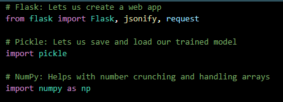
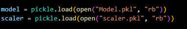
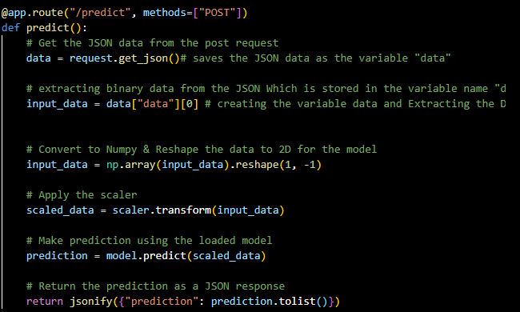
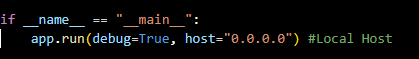
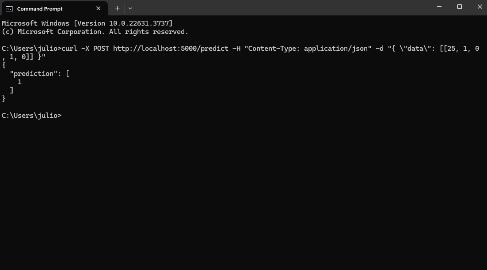
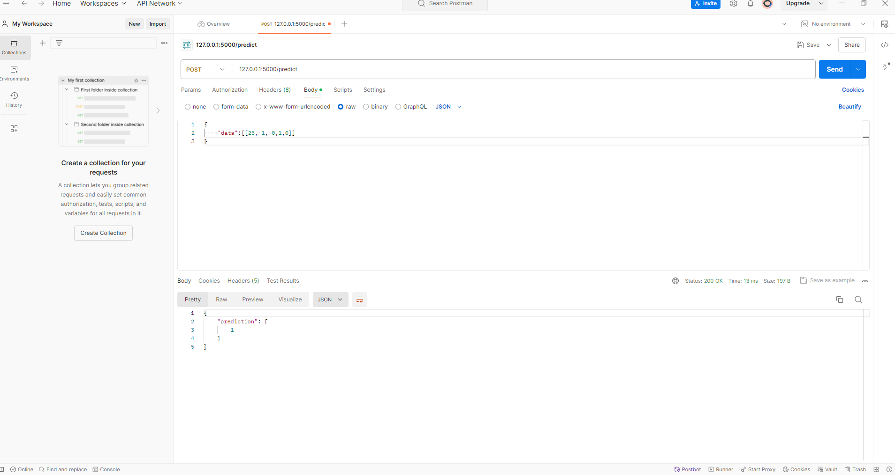

### Titanic ML Model Prediction API
This project demonstrates how to use a trained Machine Learning model with the Titanic dataset, save it as a pickle file, and create a Flask application that uses this model to make predictions. The application provides an endpoint to make predictions by sending JSON data via Postman. The process includes importing necessary libraries, loading pretrained models, defining routes for predictions, running the Flask app, and handling POST requests to obtain predictions. Using nested lists in POST requests ensures consistent data format, scalability, and accurate data processing for the model.
## Required imports

### Explanations 

**Flask**: Creates the web app.

**jsonify**: Turns data into JSON format to send back to the client-side (Postman).

**request**: Lets us get data from incoming requests.

**pickle**: Saves and loads our trained machine learning model and other data.

**NumPy**: Makes it easy to work with numbers and arrays, which is useful for preparing data for the model.

## Loading Pretrained Model & Scaler


- These lines loads and opens the pre-trained machine learning model and scaler from pickle files.


## Defining Routes / Web Endpoints

**@app.route("/")**: This decorator creates an endpoint for the root URL ("/").
**methods=["GET"]**: Specifies that this route will handle GET requests.
Function test:
This function is executed when a GET request is made to the root URL.
It returns a JSON response with the message "Hello World".
## Prediction Endpoint

- The `/predict` endpoint in the Flask app handles POST requests.
- It retrieves JSON data from the request.
- Extracts and reshapes the input values into a 2D NumPy array.
- Scales the input data using a preloaded scaler.
- Uses a pre-trained model to make a prediction.
- The prediction is then returned as a JSON response.
## Running the App

- This block checks if the script is being run directly (not imported as a module).
- If true, it starts the Flask web server with debugging enabled (debug=True).
- host="0.0.0.0" makes the server accessible from any network interface, not just locally.

### Start the app & Send Curl request
To start the Flask application, run the following command in your terminal:

- python "your_app_name".py  in the your IDE terminal. In my case its app.py. 

- Then send Curl Request. 

### Understanding the `curl` Command

- **`curl`**:
  - This is the command itself. Think of it as your way to talk to the server.

- **`-X POST`**:
  - This tells `curl` to use the POST method. POST is like sending a letter with information to the server.

- **`http://127.0.0.1:5000/predict`**:
  - This is the address of our Flask application. It’s like the server’s home address.
  - `127.0.0.1` means your own computer (localhost).
  - `:5000` is the port where Flask is listening.
  - `/predict` is the specific route that will handle our request.

- **`-H "Content-Type: application/json"`**:
  - This sets a header to tell the server what kind of data we’re sending. Here, it's JSON, which is a common data format.

- **`-d "{\"data\": [[25, 1, 0, 1, 0]]}"`**:
  - This is the data we are sending to the server. It includes:
    - `-d`: Stands for data.
    - `"{\"data\": [[25, 1, 0, 1, 0]]}"`: This is the actual data in JSON format. Note the escape characters `\"` for the double quotes inside the JSON string.

### What Happens Next?

- The `curl` command sends the data to the `/predict` endpoint of our Flask application.
- Flask processes the data, makes a prediction using the model, and sends the prediction back as a response.


## Post Request to /predict


- **Open** Postman and configure your request:

- **Set** the request type to POST.
- **Enter** the URL: http://127.0.0.1:5000/predict.
- **Format:** Go to the "Body" tab, select "raw" and set the format to JSON.
**Enter the JSON data**:
- **"data"**: The key in the JSON object.
**[[25, 1, 0, 1, 0]]**: The value, which is an array containing arrays of input values.
- **Click** the "Send" button to send the request.

### In case you're wondering: Why Nested Lists in POST Request?

- **Consistent Data Format**: Machine learning models expect input data in a 2D array format, even for a single sample. This format ensures the model receives data correctly.
- **Handling Multiple Samples**: Allows the endpoint to process multiple samples in one request, enhancing scalability.
- **Data Processing**: Ensures the input data is consistently formatted for the model, preventing errors and ensuring accurate predictions.

Example:
```json
{
  "data": [[25, 1, 0, 1, 0], [30, 1, 0, 1, 0]]
}
